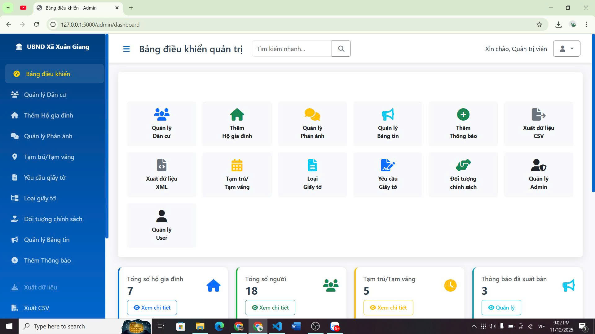
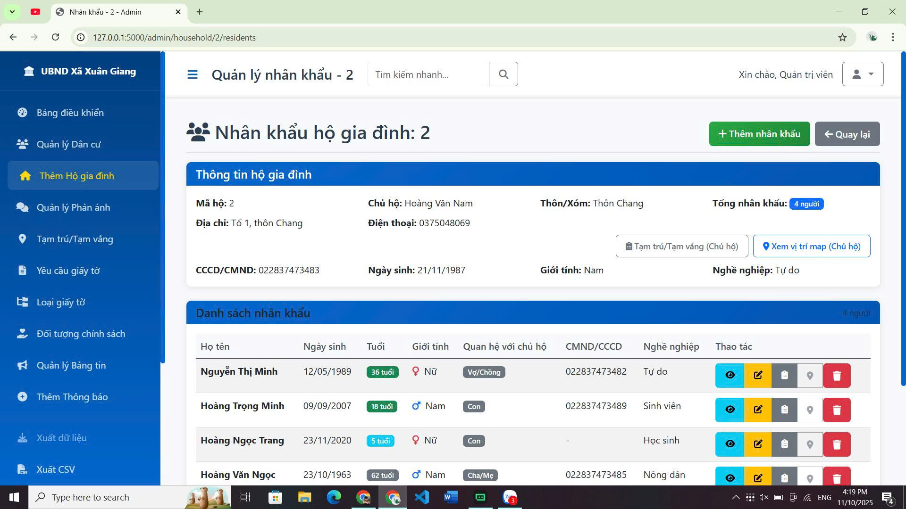
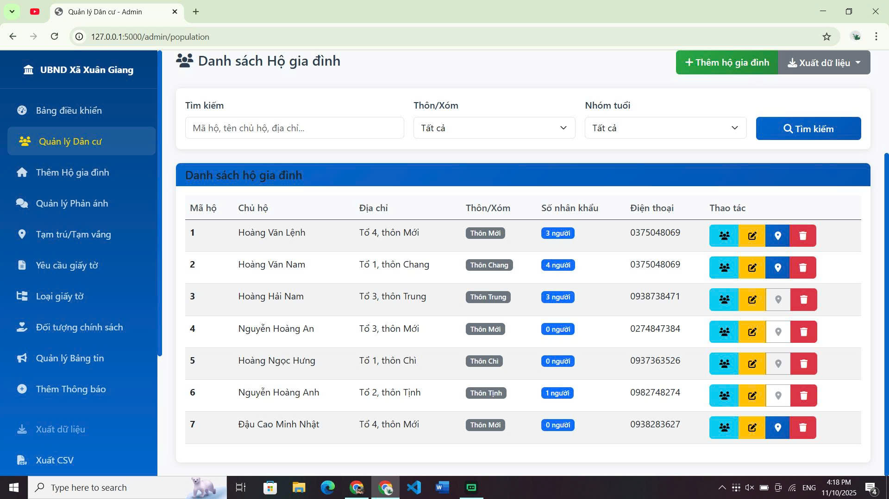
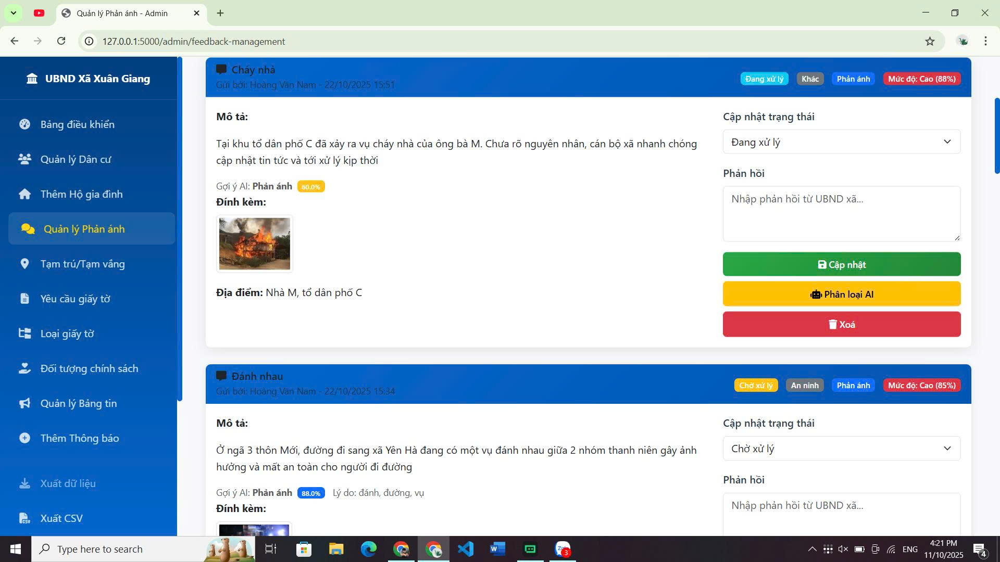

<h2 align="center"> 
     <a href="https://dainam.edu.vn/vi/khoa-cong-nghe-thong-tin"> 
     🎓 Faculty of Information Technology (DaiNam University) 
     </a> 
 </h2> 
 <h2 align="center"> 
    HỆ THỐNG QUẢN LÝ DÂN CƯ VÀ TƯƠNG TÁC CỘNG ĐỒNG UBND XÃXÃ
 </h2> 
 <div align="center"> 
     <p align="center"> 
          
          
          
     </p> 

 [](https://www.facebook.com/DNUAIoTLab) 
 [](https://dainam.edu.vn/vi/khoa-cong-nghe-thong-tin) 
 [](https://dainam.edu.vn) 
 
 </div> 
 
 --- 
 ## 1. Giới thiệu hệ thống 
 Hệ thống Quản lý Hành chính Xã là ứng dụng web hỗ trợ chính quyền xã/phường quản lý dân cư, hộ gia đình, tạm trú/tạm vắng, trợ cấp/phúc lợi, yêu cầu giấy tờ, thông báo/bản tin và phản hồi của người dân. Ứng dụng phân quyền rõ ràng (quản trị viên, người xem, công dân), có chức năng xuất dữ liệu CSV/XML, tìm kiếm/lọc theo thôn/xóm và nhóm tuổi, cùng với mô-đun phân loại phản hồi bằng học máy. 
 
 Kiến trúc tổng quan: 
 - Máy chủ `Flask` xử lý nghiệp vụ, REST routes theo blueprint (`blueprints/`). 
 - Giao diện web sử dụng `Jinja2` + `Bootstrap 5`. 
 - Cơ sở dữ liệu `SQLite` (tệp `instance/commune_admin.db`). 
 - Mô-đun ML phân loại phản hồi (`services/feedback_classifier.py`) và scripts huấn luyện (`scripts/`). 
 
 Các đặc điểm nổi bật: 
 - Quản lý hộ gia đình và nhân khẩu (thêm/sửa/xóa, liên kết hộ). 
 - Xuất dữ liệu dân cư CSV/XML theo thôn/xóm (lọc `hamlet`). 
 - Tìm kiếm + lọc nhanh trên bảng dân cư, hộ gia đình. 
 - Quản lý tạm trú/tạm vắng, trợ cấp, loại giấy tờ, và yêu cầu giấy tờ. 
 - Bản tin, thông báo, và hệ thống người dùng công dân. 
 - Phân quyền truy cập bằng decorator (`admin_required`, `viewer_allowed`, `admin_or_self`). 
 - Phản hồi người dân được phân loại tự động, hỗ trợ gửi email (cấu hình trong `config/`). 
 
 --- 
 
 ## 2. Ngôn ngữ & Công nghệ sử dụng 
 <div align="center"> 
 
 [](https://www.python.org/) 
 [](https://flask.palletsprojects.com/) 
 [](https://www.sqlite.org/) 
 [](https://getbootstrap.com/) 
 [](https://jinja.palletsprojects.com/) 
 [](https://pandas.pydata.org/) 
 [](https://scikit-learn.org/) 
 
 </div> 
 
 --- 
 
 ## 3. Hình ảnh một số các chức năng
 <p align="center"> 
    
   <br/> 
   <em>Hình 1. 🖥️ Bảng điều khiển quản trị</em><br/> 
 </p> 
 --- 
 <p align="center"> 
    
   <br/> 
   <em>Hình 2. 🖥️ Quản lý dân cư (tìm kiếm, lọc, xuất CSV/XML)</em><br/> 
 </p> 
 --- 
 <p align="center"> 
    
   <br/> 
   <em>Hình 3. 🖥️ Quản lý hộ gia đình</em><br/> 
 </p> 
 --- 
 <p align="center"> 
    
   <br/> 
   <em>Hình 4. 🖥️ Phản hồi người dân và phân loại mức độ</em><br/> 
 </p>  
 --- 
 
 ## 4. Các bước cài đặt 
 1. **Cài đặt môi trường**  
    - Python 3.10 trở lên  
    - pip, virtualenv (khuyến nghị)  
    - IDE khuyến nghị: VS Code / PyCharm  
 
 2. **Chuẩn bị cơ sở dữ liệu**  
    - Mặc định dùng SQLite với tệp `instance/commune_admin.db`.  
    - Lần chạy đầu, DB sẽ được tạo tự động nếu chưa tồn tại.  
 
 3. **Cài đặt phụ thuộc**  
    - Tạo và kích hoạt môi trường ảo:  
      - Windows (PowerShell):  
        ```powershell
        python -m venv .venv
        .\.venv\Scripts\Activate.ps1
        ```
      - Cài đặt dependencies:  
        ```bash
        pip install -r requirements.txt
        ```
 
 4. **Chạy ứng dụng**  
    - Chạy server ở chế độ phát triển:  
      ```bash
      python main.py
      ```
    - Truy cập: `http://127.0.0.1:5000/`  
    - Khu vực quản trị: `http://127.0.0.1:5000/admin`  
 
 5. **Tài khoản & phân quyền**  
    - Đăng ký và đăng nhập qua giao diện (`/auth/login`, `/auth/register`).  
    - Phân quyền dựa trên decorator trong `utils.py`: `admin_required`, `viewer_allowed`, `admin_or_self`.  
 
 6. **Xuất dữ liệu CSV/XML**  
    - Tại trang Quản lý Dân cư, dùng nút "Xuất dữ liệu".  
    - Có thể lọc theo thôn/xóm:  
      - CSV: `/admin/export/residents?format=csv&hamlet=<ten_thon_xom>`  
      - XML: `/admin/export/residents?format=xml&hamlet=<ten_thon_xom>`  
 
 7. **Cấu hình email & AI**  
    - Email: `config/mail_config.json`  
    - Cấu hình API: `config/api_config.json`  
    - Mô-đun ML: `services/feedback_classifier.py`, mô hình trong thư mục `models/`.  
    - Scripts huấn luyện/tái huấn luyện: `scripts/` (ví dụ `train_model.py`).  
 
 8. **Tài liệu thủ tục**  
    - Xem tệp: `Thu_tuc_giay_to.md` để tham khảo tóm tắt thủ tục tại xã.
 
 --- 
 
 ## 5. Lộ trình tính năng (gợi ý) 
 - Bộ lọc nâng cao: nhóm tuổi, trạng thái tạm trú/tạm vắng. 
 - Nhật ký hoạt động và kiểm toán thay đổi dữ liệu. 
 - Tích hợp thông báo qua email/SMS cho bản tin và kết quả xử lý giấy tờ. 
 - Xuất dữ liệu theo định dạng thêm (JSON, Excel). 
 
 --- 
 
 ## 6. Thông tin liên hệ  
 Họ tên: Hoàng Mạnh Linh.  
 Lớp: CNTT 16-03.  
 Email: linhmanhhoang03@gmail.com.  
 
 © 2025 AIoTLab, Faculty of Information Technology, DaiNam University. All rights reserved. 
 
---
 
### Ghi chú triển khai 
- Kho mã nguồn chính nằm ở thư mục gốc (Flask app: `app.py`, `main.py`, blueprints trong `blueprints/`, templates trong `templates/`).  
- Nếu gặp lỗi khi xuất dữ liệu do nhân khẩu chưa gắn hộ, hệ thống đã xử lý null an toàn trong `utils.py` (hàm `export_residents_to_csv/xml`).  
- Với UI Bootstrap 5, bảo đảm các nút dropdown dùng `data-bs-toggle="dropdown"` và đã nạp `bootstrap.bundle.min.js` trong `templates/admin/base_admin.html`.
